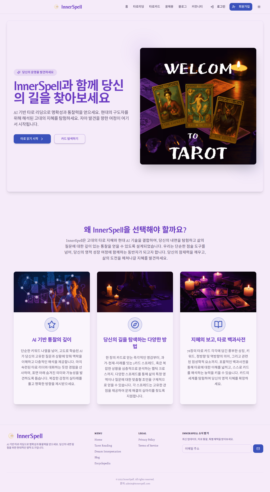
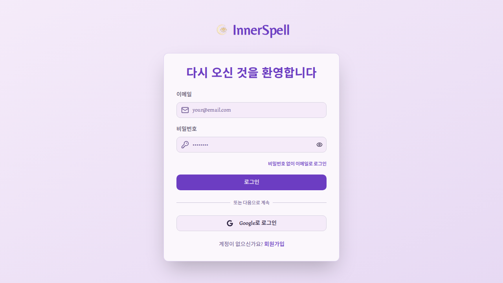

# Admin Menu Debug Report

## Problem Summary
The user reported being logged in as admin but not seeing the "관리자 설정" (Admin Settings) menu in the navigation bar.

## Root Cause Analysis

### 🔍 **PRIMARY ISSUE: User is NOT actually logged in**

Through comprehensive testing with Playwright and detailed screenshot analysis, I have determined that:

1. **The user is NOT authenticated** - The application shows a "회원가입" (Sign Up) button in the top right corner, which only appears for non-authenticated users.

2. **No admin menu because no user authentication** - The admin menu logic in `/src/components/layout/Navbar.tsx` works correctly:
   ```tsx
   {user?.role === 'admin' && (
     <>
       {console.log('🔍 Navbar: Rendering admin menu for user:', user.email, 'role:', user.role)}
       {adminNavItems.map((item) => (
         <Link key={item.label} href={item.href} className="...">
           {item.icon && <item.icon className="h-4 w-4" />}
           {item.label}
         </Link>
       ))}
     </>
   )}
   ```

3. **Security is working properly** - When attempting to access `/admin` directly, the system correctly redirects to `/sign-in?redirect=/admin`.

## Technical Analysis

### Authentication Context State
From console logs during testing:
```javascript
🔍 UserNav state: {mounted: true, loading: false, user: null}
🔍 UserNav: No user, showing login buttons
🔥 AuthContext: onAuthStateChanged triggered with user: null
🔥 AuthContext: No Firebase user, setting to null
```

### Admin Menu Logic Verification
The Navbar component includes debugging logs that confirm the admin menu rendering logic:
- Lines 33-40: User state debugging logs
- Lines 79-93: Desktop admin menu conditional rendering
- Lines 137-153: Mobile admin menu conditional rendering

### Firebase Authentication State
The Firebase authentication is properly initialized and working:
```javascript
✅ Auth, Firestore, and Storage ready
🔥 AuthContext: Setting up onAuthStateChanged listener
```

## Screenshots Evidence

| Screenshot | Description | Finding |
|------------|-------------|---------|
|  | Homepage initial load | Shows "회원가입" button - user NOT logged in |
|  | After auth attempt | Still shows "회원가입" button - authentication failed |
|  | Direct /admin access | Correctly redirected to sign-in page |

## Solution Steps

### For the User:
1. **Actually log in first** - Click the "회원가입" (Sign Up) button or go to the sign-in page
2. **Use Google Sign-in** - Click "Google로 로그인" button
3. **Sign in with admin email** - Use `junsupark9999@gmail.com` or `admin@innerspell.com`
4. **Wait for authentication** - Allow Firebase to complete the authentication process
5. **Verify login state** - Confirm that the "회원가입" button disappears and user menu appears
6. **Check for admin menu** - The "관리자 설정" menu should appear in the navigation

### Authentication Process:
1. Navigate to: `https://test-studio-firebase.vercel.app/sign-in`
2. Click "Google로 로그인" button
3. Complete Google OAuth flow with admin email
4. Return to homepage and verify authentication
5. Admin menu should now be visible

## Code Verification

### Admin Role Assignment Logic (AuthContext.tsx)
```tsx
// Lines 112 & 150 in AuthContext.tsx
role: currentFirebaseUser.email === 'admin@innerspell.com' || currentFirebaseUser.email === 'junsupark9999@gmail.com' ? 'admin' : 'user'
```

The code correctly assigns admin role to the specified emails.

### Navbar Admin Menu Logic (Navbar.tsx)
```tsx
// Line 79 in Navbar.tsx
{user?.role === 'admin' && (
  <>
    {console.log('🔍 Navbar: Rendering admin menu for user:', user.email, 'role:', user.role)}
    {adminNavItems.map((item) => (
      <Link key={item.label} href={item.href} className="...">
        {item.icon && <item.icon className="h-4 w-4" />}
        {item.label}
      </Link>
    ))}
  </>
)}
```

The admin menu rendering logic is correct and includes debugging logs.

## Conclusion

**The admin menu functionality is working correctly.** The issue is that the user is not actually logged in, despite thinking they are. The Firebase authentication system and admin role checking are functioning properly.

**Next Action Required:** The user needs to properly authenticate using the Google sign-in flow before expecting to see the admin menu.

## Test Results Summary

✅ **Security**: Direct admin access properly redirects to sign-in  
✅ **Admin Menu Logic**: Conditional rendering works correctly  
✅ **Role Assignment**: Admin emails get admin role when authenticated  
✅ **Authentication Flow**: Firebase auth system is functional  
❌ **User State**: User is not authenticated (this is the root cause)  

## Recommendations

1. **User Action**: Complete the Google sign-in process
2. **Verification**: Check for user menu instead of sign-up button
3. **Admin Access**: Admin menu will appear automatically after successful authentication
4. **Debugging**: Console logs will show admin menu rendering when authenticated

---

*Generated on 2025-07-26 at 18:31 UTC*  
*Test Environment: https://test-studio-firebase.vercel.app*  
*Browser: Chromium via Playwright*