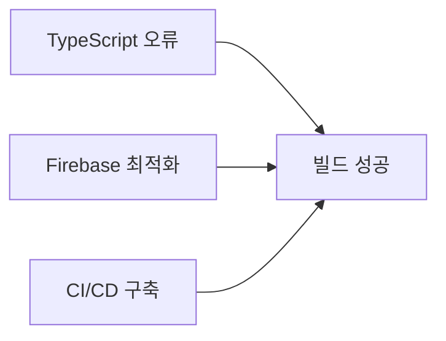
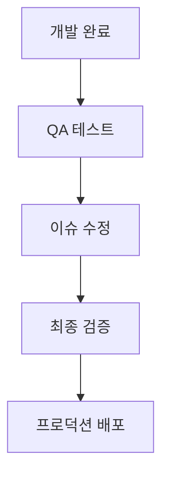

# 🎯 InnerSpell 프로젝트 우선순위별 작업 분배

## 📅 작성일: 2025년 1월 3일
## 👔 작성자: PM Claude

---

## 🔴 높음 (High Priority) - 즉시 착수

### 1. TypeScript 오류 해결 (Day 1-2)
**담당**: TypeScript Specialist  
**의존성**: 없음  
**영향도**: 전체 프로젝트 블로킹  

```bash
# 시작 커맨드
npm run typecheck > typescript-errors.log
# 오류 분석 후 카테고리별 해결
```

**주요 작업**:
- any 타입 제거 (~100개)
- null/undefined 처리
- 타입 불일치 해결
- API 응답 타입 정의

---

### 2. Firebase 최적화 (Day 1-3)
**담당**: Backend Specialist  
**의존성**: 없음  
**영향도**: 성능 및 비용 직결  

```javascript
// 쿼리 최적화 예시
db.collection('users')
  .where('status', '==', 'active')
  .where('lastActive', '>=', thirtyDaysAgo)
  .orderBy('lastActive', 'desc')
  .limit(100);
```

**주요 작업**:
- Firestore 인덱스 생성
- 보안 규칙 최적화
- API 캐싱 구현
- 목업 데이터 제거

---

### 3. CI/CD 파이프라인 구축 (Day 1-2)
**담당**: DevOps Specialist  
**의존성**: TypeScript 오류 해결 후 최적  
**영향도**: 배포 자동화 필수  

```yaml
# GitHub Actions 워크플로우
- quality-check (TypeScript, ESLint, Prettier)
- test (unit, integration, e2e)
- build-deploy (Vercel 자동 배포)
```

**주요 작업**:
- GitHub Actions 설정
- 자동 테스트 통합
- Vercel 배포 자동화
- 모니터링 시스템 구축

---

## 🟡 중간 (Medium Priority) - 순차 진행

### 4. UX/UI 최종 점검 (Day 3-4)
**담당**: UX/UI Specialist  
**의존성**: TypeScript 오류 해결 완료 후  
**영향도**: 사용자 경험 품질  

```css
/* 반응형 검증 포인트 */
@media (max-width: 640px) { /* 모바일 */ }
@media (max-width: 768px) { /* 태블릿 */ }
@media (max-width: 1024px) { /* 데스크톱 */ }
```

**주요 작업**:
- 모바일 반응형 검증
- WCAG 2.1 AA 준수
- 다크모드 일관성
- 디자인 시스템 문서화

---

### 5. 종합 테스트 실행 (Day 5-7)
**담당**: QA Specialist  
**의존성**: 모든 개발 작업 완료 후  
**영향도**: 품질 보증  

```typescript
// E2E 테스트 커버리지
- 인증 플로우: 100%
- 타로 리딩: 100%
- 꿈해몽: 100%
- 결제 프로세스: 100%
```

**주요 작업**:
- E2E 테스트 자동화
- 성능 테스트
- 보안 취약점 스캔
- 크로스 브라우저 테스트

---

## 🟢 낮음 (Low Priority) - 여유시 진행

### 6. 문서화 및 가이드
**담당**: 전 팀 협업  
**의존성**: 각 작업 완료 후  
**영향도**: 유지보수성  

**작업 내용**:
- API 문서 자동 생성
- 컴포넌트 Storybook
- 운영 가이드
- 개발자 온보딩 문서

---

## 📊 병렬 처리 가능 작업

### 동시 진행 가능 (Day 1-2)


1. **TypeScript Specialist**: 타입 오류 해결
2. **Backend Specialist**: Firebase 쿼리 최적화
3. **DevOps Specialist**: 파이프라인 기초 구축

### 순차 진행 필수


---

## 🚨 크리티컬 패스

### 최단 경로 (7일)
1. **Day 1-2**: TypeScript + Backend + DevOps (병렬)
2. **Day 3-4**: UX/UI 검증 + 통합
3. **Day 5-6**: QA 테스트 실행
4. **Day 7**: 최종 검토 및 배포

### 리스크 버퍼
- TypeScript 오류 예상외 복잡도: +1일
- Firebase 마이그레이션 이슈: +1일
- QA 테스트 실패 수정: +2일
- **총 버퍼**: 4일

---

## 📈 진행률 추적

### 일일 체크포인트
```javascript
const dailyCheckpoints = {
  day1: {
    typescript: "오류 분석 완료",
    backend: "인덱스 생성 시작",
    devops: "CI 파이프라인 설정"
  },
  day2: {
    typescript: "주요 오류 50% 해결",
    backend: "API 캐싱 구현",
    devops: "자동 배포 테스트"
  },
  // ... 계속
};
```

### 주요 마일스톤
- [ ] **M1**: 빌드 성공 (Day 2)
- [ ] **M2**: 모든 테스트 통과 (Day 5)
- [ ] **M3**: 스테이징 배포 (Day 6)
- [ ] **M4**: 프로덕션 배포 (Day 7)

---

## 🔄 작업 의존성 매트릭스

| 작업 | TypeScript | Backend | UX/UI | DevOps | QA |
|------|------------|---------|--------|---------|-----|
| TypeScript 오류 | - | 독립 | 대기 | 독립 | 대기 |
| Firebase 최적화 | 독립 | - | 독립 | 독립 | 대기 |
| UX/UI 검증 | 필요 | 독립 | - | 독립 | 선행 |
| CI/CD 구축 | 권장 | 독립 | 독립 | - | 필요 |
| QA 테스트 | 필수 | 필수 | 필수 | 필수 | - |

---

## 💡 효율성 극대화 전략

### 1. 블로킹 이슈 우선 해결
- TypeScript 오류는 다른 작업을 막을 수 있음
- Firebase 성능은 테스트에 영향
- CI/CD는 반복 작업 자동화

### 2. 커뮤니케이션 최적화
```yaml
communication:
  daily_standup: "10:00 AM"
  blocker_alert: "즉시"
  progress_update: "18:00 PM"
  tools:
    - Slack/Discord
    - GitHub Issues
    - Project Board
```

### 3. 리소스 활용
- 병렬 작업 최대화
- 대기 시간 최소화
- 자동화 도구 적극 활용

---

## 🎯 성공 지표 (KPIs)

### 기술적 지표
- [ ] TypeScript 오류: 0개
- [ ] API 응답시간: <200ms
- [ ] 테스트 커버리지: >80%
- [ ] 빌드 시간: <5분

### 비즈니스 지표
- [ ] 페이지 로드: <2초
- [ ] 에러율: <0.1%
- [ ] 가동률: 99.9%
- [ ] 사용자 만족도: >4.5/5

---

## 📝 작업 완료 체크리스트

### 개발 완료 기준
- [ ] 모든 TypeScript 오류 해결
- [ ] Firebase 쿼리 최적화 완료
- [ ] API 응답 시간 목표 달성
- [ ] 목업 데이터 완전 제거

### 품질 완료 기준
- [ ] E2E 테스트 100% 통과
- [ ] 성능 테스트 기준 충족
- [ ] 보안 취약점 0개
- [ ] 접근성 검증 통과

### 배포 준비 기준
- [ ] CI/CD 파이프라인 가동
- [ ] 모니터링 시스템 활성화
- [ ] 롤백 계획 수립
- [ ] 문서화 완료

---

**PM 서명**: Claude AI  
**최종 검토**: 2025년 1월 3일  
**다음 업데이트**: Day 2 종료 시점