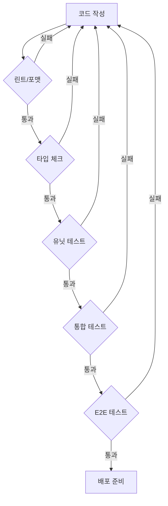

# 🏆 InnerSpell 프로젝트 품질 검증 계획

## 📅 작성일: 2025년 1월 3일
## 👔 품질 관리자: PM Claude

---

## 📊 품질 검증 체계

### 1. 품질 게이트 (Quality Gates)



### 2. 자동화된 품질 검사

```yaml
# .github/workflows/quality-check.yml
name: Quality Gates

on: [push, pull_request]

jobs:
  quality-check:
    runs-on: ubuntu-latest
    steps:
      - name: Code Quality
        run: |
          npm run lint
          npm run format:check
          npm run typecheck
      
      - name: Test Suite
        run: |
          npm run test:unit
          npm run test:integration
          npm run test:e2e
      
      - name: Coverage Check
        run: |
          npm run test:coverage
          # 최소 80% 커버리지 필수
```

---

## 🔍 단계별 품질 검증

### Phase 1: 코드 품질 (Day 1-2)

#### 1.1 정적 분석
```typescript
// ESLint 설정 (.eslintrc.js)
module.exports = {
  extends: [
    'next/core-web-vitals',
    'plugin:@typescript-eslint/recommended',
    'plugin:security/recommended',
    'plugin:jsx-a11y/recommended'
  ],
  rules: {
    '@typescript-eslint/no-explicit-any': 'error',
    '@typescript-eslint/explicit-function-return-type': 'warn',
    'security/detect-object-injection': 'error',
    'jsx-a11y/anchor-is-valid': 'error'
  }
};
```

#### 1.2 타입 안전성
```bash
# TypeScript strict 모드 검증
tsc --noEmit --strict
# 타입 커버리지 측정
npx type-coverage --detail
```

**검증 기준**:
- [ ] TypeScript 오류 0개
- [ ] 타입 커버리지 95% 이상
- [ ] any 타입 사용 0개
- [ ] ESLint 오류 0개

---

### Phase 2: 기능 검증 (Day 3-4)

#### 2.1 단위 테스트
```typescript
// 예시: 타로 카드 선택 로직 테스트
describe('TarotCardSelection', () => {
  it('should select exactly 3 cards', () => {
    const deck = createTarotDeck();
    const selected = selectCards(deck, 3);
    
    expect(selected).toHaveLength(3);
    expect(new Set(selected).size).toBe(3); // 중복 없음
  });
  
  it('should not allow selecting same card twice', () => {
    const card = { id: 'fool', name: 'The Fool' };
    const selection = new CardSelection();
    
    selection.add(card);
    expect(() => selection.add(card)).toThrow('Card already selected');
  });
});
```

#### 2.2 통합 테스트
```typescript
// API 통합 테스트
describe('API Integration', () => {
  it('should create and retrieve reading', async () => {
    // 1. 리딩 생성
    const createResponse = await api.post('/readings', {
      question: 'Test question',
      cards: ['fool', 'magician', 'priestess']
    });
    
    expect(createResponse.status).toBe(201);
    const { id } = createResponse.data;
    
    // 2. 리딩 조회
    const getResponse = await api.get(`/readings/${id}`);
    expect(getResponse.data.question).toBe('Test question');
  });
});
```

**검증 기준**:
- [ ] 핵심 비즈니스 로직 100% 테스트
- [ ] API 엔드포인트 100% 테스트
- [ ] 엣지 케이스 처리 검증
- [ ] 에러 핸들링 검증

---

### Phase 3: 사용자 경험 검증 (Day 5)

#### 3.1 E2E 시나리오
```typescript
// 전체 사용자 여정 테스트
test('Complete user journey', async ({ page }) => {
  // 1. 랜딩 페이지
  await page.goto('/');
  await expect(page).toHaveTitle(/InnerSpell/);
  
  // 2. 회원가입
  await page.click('text=시작하기');
  await page.fill('input[name="email"]', 'test@example.com');
  await page.fill('input[name="password"]', 'SecurePass123!');
  await page.click('button[type="submit"]');
  
  // 3. 타로 리딩
  await page.click('text=타로 리딩');
  await performTarotReading(page);
  
  // 4. 결과 저장
  await page.click('text=저장');
  await expect(page.locator('.save-success')).toBeVisible();
  
  // 5. 프로필에서 확인
  await page.goto('/profile');
  await expect(page.locator('.saved-readings')).toContainText('1개의 리딩');
});
```

#### 3.2 크로스 브라우저 테스트
```javascript
const browsers = ['chromium', 'firefox', 'webkit'];
const devices = ['Desktop', 'iPhone 12', 'Pixel 5'];

for (const browser of browsers) {
  for (const device of devices) {
    test(`${browser} on ${device}`, async ({ page }) => {
      // 각 브라우저/디바이스 조합 테스트
    });
  }
}
```

**검증 기준**:
- [ ] 주요 사용자 시나리오 100% 통과
- [ ] 모든 브라우저/디바이스 호환
- [ ] 오류 시나리오 적절한 처리
- [ ] 로딩 시간 < 3초

---

### Phase 4: 성능 검증 (Day 6)

#### 4.1 로드 테스트
```javascript
// K6 부하 테스트 스크립트
import http from 'k6/http';
import { check, sleep } from 'k6';

export const options = {
  stages: [
    { duration: '2m', target: 100 }, // 100 사용자
    { duration: '5m', target: 100 }, // 유지
    { duration: '2m', target: 200 }, // 200 사용자
    { duration: '5m', target: 200 }, // 유지
    { duration: '2m', target: 0 },   // 램프다운
  ],
  thresholds: {
    http_req_duration: ['p(95)<500'], // 95% 요청이 500ms 이내
    http_req_failed: ['rate<0.1'],    // 에러율 10% 미만
  },
};

export default function () {
  const res = http.get('https://test-studio-firebase.vercel.app');
  check(res, {
    'status is 200': (r) => r.status === 200,
    'response time < 500ms': (r) => r.timings.duration < 500,
  });
  sleep(1);
}
```

#### 4.2 성능 메트릭
```typescript
// Web Vitals 측정
const metrics = {
  LCP: 2.5,  // Largest Contentful Paint < 2.5s
  FID: 100,  // First Input Delay < 100ms
  CLS: 0.1,  // Cumulative Layout Shift < 0.1
  TTFB: 800, // Time to First Byte < 800ms
};

// Lighthouse CI 설정
module.exports = {
  ci: {
    collect: {
      url: ['https://test-studio-firebase.vercel.app'],
      numberOfRuns: 5,
    },
    assert: {
      assertions: {
        'categories:performance': ['error', { minScore: 0.9 }],
        'categories:accessibility': ['error', { minScore: 0.9 }],
        'categories:seo': ['error', { minScore: 0.9 }],
      },
    },
  },
};
```

**검증 기준**:
- [ ] 동시 접속 200명 처리
- [ ] 평균 응답시간 < 200ms
- [ ] 에러율 < 1%
- [ ] Core Web Vitals 모두 "Good"

---

### Phase 5: 보안 검증 (Day 6)

#### 5.1 취약점 스캔
```bash
# 의존성 취약점 검사
npm audit
npx snyk test

# OWASP ZAP 스캔
docker run -t owasp/zap2docker-stable zap-baseline.py \
  -t https://test-studio-firebase.vercel.app
```

#### 5.2 보안 테스트
```typescript
// 보안 테스트 시나리오
describe('Security Tests', () => {
  test('SQL Injection Prevention', async () => {
    const maliciousInput = "'; DROP TABLE users; --";
    const response = await api.post('/api/search', {
      query: maliciousInput
    });
    
    expect(response.status).not.toBe(500);
    // 데이터베이스 무결성 확인
  });
  
  test('XSS Prevention', async () => {
    const xssPayload = '<script>alert("XSS")</script>';
    const response = await api.post('/api/comment', {
      text: xssPayload
    });
    
    const saved = await api.get('/api/comments/latest');
    expect(saved.data.text).not.toContain('<script>');
  });
  
  test('Authentication Required', async () => {
    const response = await api.get('/api/user/profile');
    expect(response.status).toBe(401);
  });
});
```

**검증 기준**:
- [ ] 취약한 의존성 0개
- [ ] OWASP Top 10 검증 통과
- [ ] 민감정보 노출 없음
- [ ] 적절한 인증/인가

---

## 📋 품질 체크리스트

### 코드 품질
- [ ] 코드 컨벤션 준수
- [ ] 주석 및 문서화
- [ ] 복잡도 기준 충족
- [ ] 중복 코드 제거

### 기능 품질
- [ ] 모든 요구사항 구현
- [ ] 엣지 케이스 처리
- [ ] 에러 핸들링
- [ ] 데이터 무결성

### 성능 품질
- [ ] 응답 시간 기준
- [ ] 리소스 사용량
- [ ] 확장성
- [ ] 캐싱 전략

### 보안 품질
- [ ] 인증/인가
- [ ] 데이터 암호화
- [ ] 취약점 제거
- [ ] 감사 로그

### 사용성 품질
- [ ] 직관적 UI/UX
- [ ] 접근성 준수
- [ ] 반응형 디자인
- [ ] 오류 메시지

---

## 🚀 배포 전 최종 검증

### 배포 준비 체크리스트
```bash
#!/bin/bash
# deployment-checklist.sh

echo "🔍 배포 전 최종 검증 시작..."

# 1. 빌드 검증
npm run build || exit 1

# 2. 테스트 실행
npm run test:all || exit 1

# 3. 보안 검사
npm audit --production || exit 1

# 4. 환경변수 검증
node scripts/verify-env.js || exit 1

# 5. 데이터베이스 마이그레이션
npm run db:migrate:verify || exit 1

echo "✅ 모든 검증 통과! 배포 준비 완료"
```

### 롤백 계획
```yaml
rollback_plan:
  triggers:
    - error_rate > 5%
    - response_time > 1000ms
    - health_check_fail
  
  steps:
    1. 이전 버전으로 즉시 전환
    2. 에러 로그 수집
    3. 원인 분석
    4. 핫픽스 적용
    5. 재배포
```

---

## 📊 품질 메트릭 대시보드

### 실시간 모니터링
```typescript
const qualityMetrics = {
  // 코드 품질
  codeQuality: {
    coverage: 85,      // 목표: 80%
    complexity: 8,     // 목표: <10
    duplication: 2,    // 목표: <5%
  },
  
  // 성능 지표
  performance: {
    responseTime: 150, // 목표: <200ms
    errorRate: 0.5,    // 목표: <1%
    availability: 99.9 // 목표: 99.9%
  },
  
  // 사용자 만족도
  userSatisfaction: {
    nps: 72,          // 목표: >70
    crashFree: 99.5,  // 목표: >99%
    retention: 65     // 목표: >60%
  }
};
```

---

## 🎯 품질 목표 및 KPI

### 필수 달성 목표
1. **Zero Critical Bugs**: 크리티컬 버그 0개
2. **High Test Coverage**: 테스트 커버리지 80% 이상
3. **Fast Performance**: 모든 페이지 2초 이내 로딩
4. **Secure Application**: 보안 취약점 0개
5. **Great UX**: 사용자 만족도 4.5/5 이상

### 지속적 개선
- 주간 품질 리뷰 미팅
- 월간 성능 최적화
- 분기별 보안 감사
- 지속적인 사용자 피드백 수집

---

**품질 관리자**: PM Claude  
**최종 검토**: 2025년 1월 3일  
**다음 리뷰**: 2025년 1월 10일

> "품질은 우연이 아니라 지속적인 노력의 결과입니다."